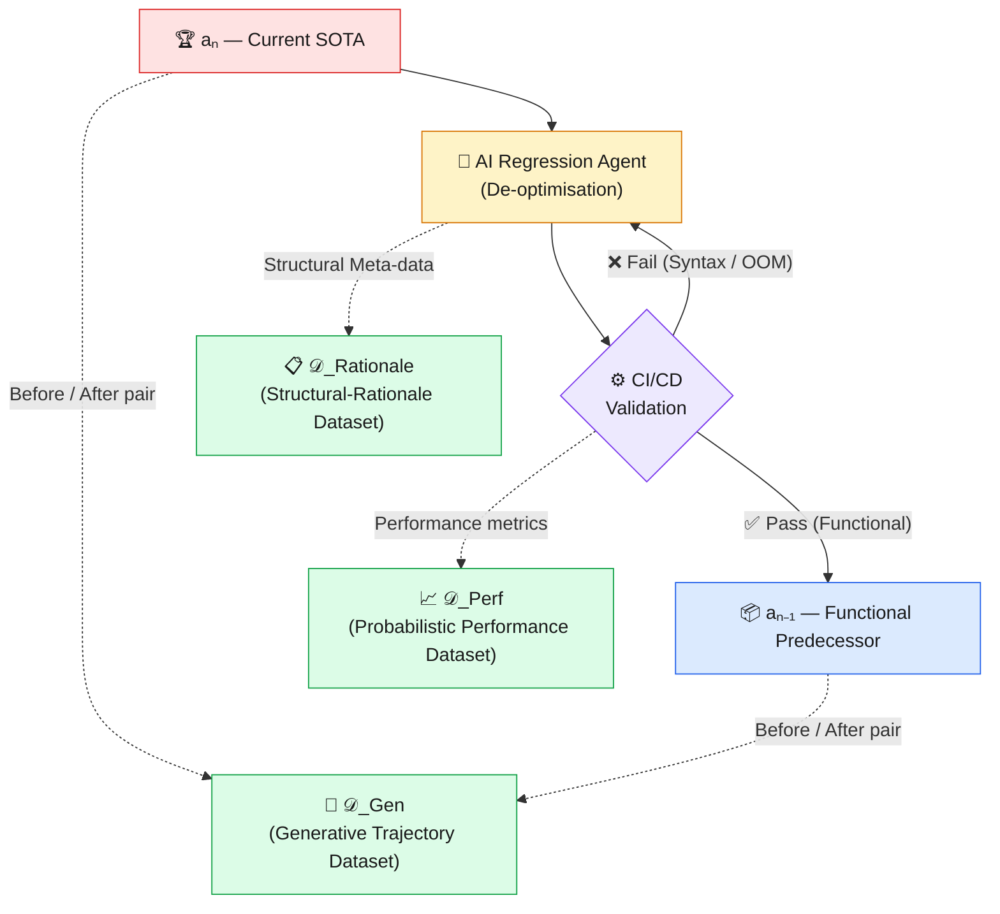
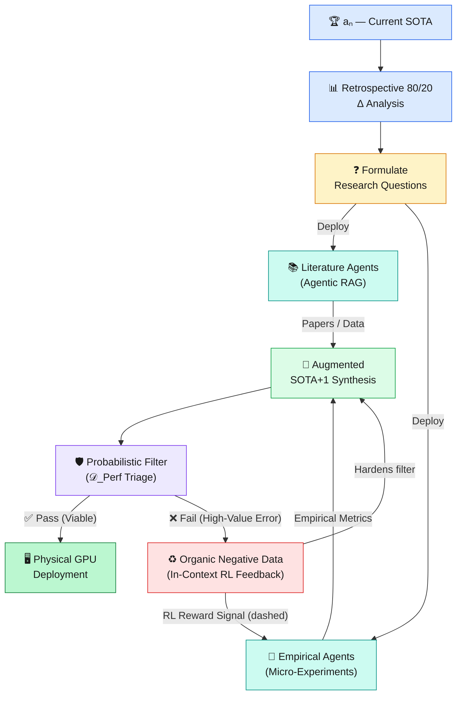
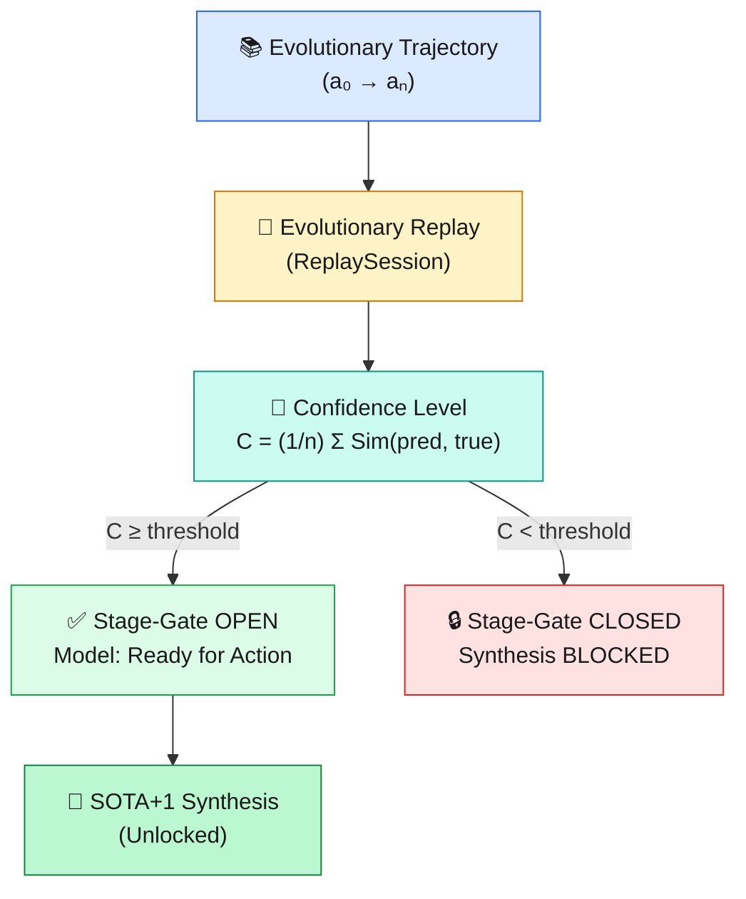
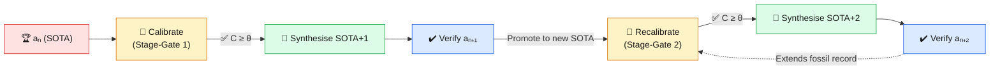

<div align="center">

# 🧬 AutoScientist-ETFT

### **Evolutionary Trajectory Fine-Tuning**
#### *Reverse-Engineering Algorithmic Progression Towards a General Innovation Accelerator*

[](https://opensource.org/licenses/MIT)
[](mailto:lukas.benda@boldpivot.cz)
[](https://github.com/luke-b/AutoScientist-ETFT)
[](https://www.python.org/)
[](https://github.com/luke-b/AutoScientist-ETFT)

> **"Teaching machines not just what we know — but the very mechanics of how we invent."**
>
> — *Lukas Benda, BoldPivot*

</div>

---

## 📖 Overview

ETFT treats technological progress itself as supervised data: ordered, causally annotated transitions between historically successive solutions are used to learn reusable innovation operators. Unlike evolutionary search systems that learn solely from online mutations, ETFT requires evolutionary replay of known historical transitions as an epistemic calibration test before permitting extrapolation beyond the known frontier. Empirically validated discoveries then extend the trajectory on which subsequent generations are recalibrated.

**AutoScientist-ETFT** is a pioneering machine learning framework that transforms Large Language Models (LLMs) from *static code generators* into **autonomous research scientists**. Rather than training on disconnected code fragments, ETFT leverages precisely AI-assisted regressions of State-of-the-Art (SOTA) algorithms to teach LLMs the fundamental vectors of architectural innovation.

This repository implements the full **Open-Loop Empirical Architecture** described in the paper *"Evolutionary Trajectory Fine-Tuning: Reverse-Engineering Algorithmic Progression"* (Benda, 2026). It addresses the critical limitation of parametric memory—the *"knowledge blindspot"*—by deploying autonomous research agents that continuously retrieve up-to-date scientific literature, run empirical micro-experiments, and recycle failures as organic negative feedback.

---

## 🔑 Key Innovations at a Glance

| Innovation | What It Does |
|---|---|
| **🔁 Evolutionary Trajectory Fine-Tuning** | Trains LLMs on ordered sequences of improving algorithms—teaching the *direction* of progress, not just individual solutions |
| **🤖 Agentic Research Loop (ARL)** | Deploys literature and empirical agents to bypass the LLM's parametric knowledge cut-off in real-time |
| **📊 Retrospective 80/20 Δ Analysis** | Deterministically identifies the sub-components historically responsible for 80% of performance gains |
| **🧪 *In-Silico* Triage Filter** | Probabilistic heuristic filter that catches high-risk hypotheses (e.g., OOM errors) *before* expensive GPU evaluation |
| **♻️ Organic Negative Data Loop** | Failed experiments and triage rejections automatically harden the filter—no manual labelling required |
| **🎯 Calibration Engine & Stage-Gate** | Evolutionary Replay protocol validates the model's readiness by reconstructing historical trajectory steps before SOTA+x synthesis is unlocked |
| **🔄 Recursive SOTA+x Discovery** | Each verified SOTA+k candidate is integrated back into the trajectory, allowing the system to recursively hypothesise SOTA+2, SOTA+3, and beyond |
| **🌐 General Innovation Accelerator** | Domain-agnostic: the same machinery applies to drug discovery, materials science, supply-chain optimisation, and beyond |

---

## 🧠 Motivation: Why Existing Approaches Fall Short

The [OpenAI Parameter Golf challenge](https://openai.com/research/) is a canonical stress-test: compress a full LLM into a **16 MB artifact**, trained in **10 minutes** on an **8 × H100 cluster**. To succeed, a model must do more than recall known solutions—it must *understand how algorithms evolve* under extreme resource constraints.

Current LLMs face two fundamental blockers:

1. **Architectural Ignorance:** Training on disconnected code snippets provides no signal about *why* one design outperforms another.
2. **The Parametric Blindspot:** Pre-trained weights fossilise knowledge at the training cut-off date. Cutting-edge breakthroughs—often published days before a competition—are invisible to the model.

ETFT solves both problems simultaneously.

---

## 📐 Theoretical Foundation: The Discrete Gradient

Let **𝒜** be a set of fully functional, compilable algorithms solving a specific task. Define an objective fitness function **ℱ(a)** inversely proportional to validation loss, subject to hard hardware constraints.

An **evolutionary trajectory 𝒯** is an ordered sequence:

```
𝒯 = (a₀, a₁, …, aₙ)   where   ℱ(aᵢ₋₁) < ℱ(aᵢ)  ∀ i
```

Each transition **aᵢ₋₁ → aᵢ** represents a *macro-evolutionary jump*—a discrete, measurable improvement in architecture, efficiency, or generalisation. The entire ETFT paradigm rests on training the model to internalise these trajectories so that it can project the next jump: **aₙ → aₙ₊₁ (SOTA+1)**.

---

## 🏗️ Architecture: The Core ETFT Ecosystem

### Phase 1 — AI-Assisted Top-Down Regression Pipeline

To build the training corpus, SOTA algorithms are *reverse-engineered* into their functional predecessors. The process is fully automated and CI/CD-validated to guarantee code integrity.



> **Figure 1 — The AI-Assisted Top-Down Regression Pipeline.**
> SOTA algorithms are systematically de-optimised into functional predecessors. Rigorous CI/CD validation ensures code integrity, enabling the automated extraction of the foundational ETFT datasets.

---

### The Three Foundational Datasets

#### 🔀 `𝒟_Gen` — Generative Trajectory Dataset
Maps each lower-complexity algorithm to its more advanced successor.
```
Input:  aᵢ₋₁  (simpler algorithm)
Output: aᵢ    (advanced successor)
```
This is the *core fine-tuning signal*: the model learns to generate improvements, not just reproduce existing code.

#### 📋 `𝒟_Rationale` — Structural-Rationale Meta-Dataset
A rich, textual breakdown of each architectural shift—mapping specific code perturbations to measurable performance changes. This teaches the model *why* a change worked, not just *what* changed.

#### 📈 `𝒟_Perf` — Probabilistic Performance Estimator
Physical GPU evaluation is expensive. `𝒟_Perf` trains a **Probabilistic Heuristic Filter** that acts as an *in-silico triage*: flagging SOTA+1 candidates with a high probability of failure (Out-Of-Memory, divergent training, etc.) *before* they consume cluster time.

> 💡 **Self-Hardening by Design:** The filter never suffers from data asymmetry. Every failed SOTA+1 hypothesis—whether caught by triage or discovered during physical testing—automatically populates the negative dataset, continuously improving predictive accuracy with zero manual annotation.

---

## 🔭 Addressing the Parametric Blindspot: The Open-Loop Architecture

### Retrospective Pareto (80/20) Δ Analysis

Rather than relying on real-time code profiling, ETFT performs a **deterministic retrospective analysis** over the entire evolutionary history:

1. **Compute deltas** between every adjacent pair (aᵢ₋₁, aᵢ) in the trajectory.
2. **Quantify the character and scope** of each historical innovation.
3. **Train the LLM** to recognise which sub-components *historically* produced 80% of the performance gain.
4. **Project the learned analytical framework** forward onto the aₙ → aₙ₊₁ trajectory.

This gives the system a rich, evidence-based prioritisation strategy that tells it *where to look* for the next breakthrough—before spending a single GPU cycle.

---

### The Agentic Research Loop (ARL)

Once the 80/20 bottlenecks are identified, the model formulates targeted **Research Questions** and launches a two-phase agentic deployment:

#### Phase 1 — Deep Literature Synthesis (Agentic RAG)
Research agents autonomously scour the latest preprints and technical reports, retrieving the most recent scientific knowledge about the specific identified bottleneck. This **bypasses the LLM's parametric cut-off date entirely**—the system is always up-to-date.

#### Phase 2 — Empirical Micro-Experiments
Coding agents execute localised scripts based on the retrieved literature, gathering physical performance metrics. These are compact, targeted experiments—not full training runs—that rapidly validate or falsify specific hypotheses.

#### In-Context Reinforcement Learning
Failed micro-experiments are not discarded. They are **immediately recycled as negative reward signals**, sharpening the agent's decision-making for subsequent experimental designs in the same context window.

---

## 🚀 The Unified Synthesis: Generating SOTA+1

The final SOTA+1 algorithm emerges from the orchestrated convergence of three streams of evidence:



> **Figure 2 — The Open-Loop Empirical ETFT Ecosystem.**
> Failed triage evaluations organically populate negative datasets and route RL reward signals back to the empirical agents, creating a continuously self-improving R&D pipeline.

### The Synthesis Inputs

| Stream | Source | Role |
|---|---|---|
| **Historical Trajectories** | `𝒟_Gen` + `𝒟_Rationale` | Provides evolutionary context and architectural rationale |
| **Live Literature** | Agentic RAG (Phase 1) | Supplies cutting-edge scientific knowledge beyond the training cut-off |
| **Empirical Evidence** | Micro-experiments (Phase 2) | Grounds hypotheses in physically measured data |
| **RL Feedback** | Failed experiments & triage | Continuously refines hypothesis generation and experimental strategy |

---

## 🎯 The Calibration Engine: Evolutionary Replay & Stage-Gate

Introduced in *"Recursive Stage-Gate Calibration for SOTA+x Discovery"* (Benda, 2026), the **Calibration Engine** enforces a hard algorithmic stage-gate that prevents the synthesiser from proposing speculative next-generation algorithms until it has demonstrably internalised the evolutionary history.

### The Morphological Constraint

A central challenge in building evolutionary trajectories is calibrating the *granularity* of each evolutionary leap. ETFT solves this through a biological analogy:

- **Macro-Evolutionary Jumps** — Each transition represents a fundamental shift in complexity or representation (e.g., dense matrices → sparse ALBERT-style architectures), not merely a syntactic edit.
- **Operational Integrity** — Every step in the trajectory must be a fully functional, compilable program. Broken code corrupts the training signal.
- **Causal Meta-Data (𝑴)** — Each `aᵢ₋₁ → aᵢ` transition is paired with quantitative impact data (e.g., "Freed 2.1 MB of code payload") and causal explanations, grounding each innovation in verifiable computer science.

### Formal Calibration Protocol

Before generating a SOTA+1 hypothesis, the model must **re-run the history** of the algorithm:

```
Input:        aᵢ₋₁  +  target performance metrics Mᵢ  (ΔLoss, ΔMemory)
Reconstruction: model synthesises aᵢ satisfying those metrics
Confidence:   C = (1/n) Σ Sim(aᵢᵖʳᵉᵈ, aᵢᵗʳᵘᵉ)              [Eq. 1]
Stage-Gate:   OPEN only when C ≥ threshold  →  model is "Ready for Action"
```

The similarity function `Sim()` is a configurable composite of:
- **Token Jaccard** — bag-of-tokens overlap (fast, reformatting-robust)
- **Line LCS** — longest-common-subsequence over source lines (order-sensitive)
- **AST Edit** — structural similarity on Python AST node sequences (syntax-invariant)



> **Figure 3 — The Calibration Engine.**
> The Evolutionary Replay protocol establishes a hard stage-gate grounded in
> verifiable computer science principles. SOTA+x synthesis is only unlocked
> when the model demonstrates functional parity with the historical trajectory.

### Readiness & Calibration Framework

| Component | Function | Verification Metric |
|---|---|---|
| **Trajectory (𝒯)** | Ordered n-tuple of functional code | `ℱ(aᵢ₋₁) < ℱ(aᵢ)` |
| **Meta-Dataset (𝑴)** | Causal grounding of each innovation | Quantitative resource deltas (ΔLoss, ΔMemory) |
| **Calibration** | Evolutionary Replay validation | Reconstruction Confidence C |
| **Stage-Gate** | Unlock speculative SOTA+x synthesis | Functional parity with historical SOTA |

---

## 🔄 Recursive SOTA+x Discovery

The true power of ETFT lies in its **recursive potential** (§3, Benda 2026). Once a SOTA+1 candidate is verified, it is not discarded — it becomes the new foundation for the next generation of innovation:



> **Figure 4 — Recursive SOTA+x Discovery.**
> Each verified SOTA+k candidate extends the "fossil record" (a₀ → aₙ₊ₖ).
> The system recalibrates on the newly extended trajectory before hypothesising
> the next generation, enabling truly multi-generational autonomous innovation.

**Key properties of recursive discovery:**

1. **Fossil Record Extension** — Each verified SOTA+k is appended to the trajectory, giving the system an ever-richer evolutionary history to learn from.
2. **Per-Generation Recalibration** — The Confidence Level C is recomputed from the *extended* trajectory before each new synthesis step, ensuring the model's understanding keeps pace with its own discoveries.
3. **Adaptive Halt** — If the stage-gate closes (C drops below threshold) or no triage-passing candidates are produced, the loop halts gracefully rather than generating unconstrained speculation.

### Quick-Start: Recursive Mode

```bash
# Generate SOTA+1, SOTA+2, and SOTA+3 in sequence with calibration between each
python synthesis/sota_plus_one/generate.py \
    --trajectory image_classification_cnn \
    --sota-code sota.py \
    --bottleneck attention_mechanism \
    --recursive \
    --generations 3
```

---

## 🌍 The General Innovation Accelerator

The implications of ETFT extend **far beyond deep learning**. An algorithm is, at its core, *any set of rules that transforms inputs into outputs*. The same evolutionary trajectory methodology applies across:

```
🔬 Materials Science      →  Tracking aerospace alloy development
💊 Pharmaceuticals        →  Mapping the progression of targeted therapies
🚚 Supply Chain           →  Optimising global logistics networks
⚡ Energy Systems         →  Evolving power grid architectures
🧬 Genomics               →  Tracing gene-editing protocol refinements
🏗️ Structural Engineering →  Iterating on load-bearing design patterns
```

By combining **historical evolutionary trajectories** with **autonomous empirical inquiry**, **probabilistic triage**, and **continuous In-Context RL feedback**, ETFT provides the foundation for a domain-agnostic **General Innovation Accelerator**—a system that teaches machines not just what we know, but the very *mechanics of how we invent*.

---

## 🧩 System Components Summary

```
AutoScientist-ETFT/
│
├── pipeline.py                    # Top-level orchestrator — all 8 pipeline stages
├── train.py                       # Fine-tuning entrypoint (HuggingFace PEFT/LoRA)
├── reporting.py                   # etft-report CLI — run summary table viewer
├── config.yaml                    # Central runtime config (Pydantic-validated)
│
├── 📂 etft/                       # Core agent/LLM infrastructure package
│   ├── agent.py                   # AgentClient — ReAct (Reason + Act) loop
│   ├── agent_cli.py               # etft-agent CLI wrapper
│   ├── agent_factory.py           # Wires domain skills to agent instances
│   ├── llm.py                     # LLMClient — HTTP proxy to coding-agent container
│   ├── config.py / config_schema.py  # Pydantic-validated config loader
│   ├── container.py               # Docker container lifecycle management
│   ├── run_logger.py              # Structured JSONL + optional MLflow logging
│   ├── sandbox.py                 # Isolated code execution (Docker / subprocess)
│   └── skills/                    # Tool definitions for the agent's ReAct loop
│       ├── base.py                # Skill ABC, SkillRegistry, LLMResponse, AgentResult
│       ├── analysis_skills.py
│       ├── code_skills.py
│       ├── experiment_skills.py
│       ├── feedback_skills.py
│       ├── filter_skills.py
│       ├── literature_skills.py
│       └── synthesis_skill.py
│
├── 📂 corpus/
│   ├── regression_pipeline/       # AI-Assisted Top-Down Regression (𝒟_Gen, 𝒟_Rationale)
│   ├── performance_estimator/     # Probabilistic Heuristic Filter (𝒟_Perf)
│   └── orthogonal/                # Width/Depth training split dataset builder
│
├── 📂 calibration/
│   ├── engine.py                  # CalibrationEngine — Evolutionary Replay orchestrator
│   ├── replay.py                  # ReplaySession — model-driven step reconstruction
│   ├── stage_gate.py              # StageGate — blocks synthesis until C ≥ threshold
│   ├── similarity.py              # Sim() functions: token Jaccard, LCS, AST, composite
│   ├── objective_calibration.py   # Objective quality gate for SOTA+x candidates
│   └── analysis/
│       └── threshold_search.py    # Calibration threshold analysis tooling
│
├── 📂 agents/
│   ├── literature/                # Agentic RAG — Deep Literature Synthesis
│   ├── empirical/                 # Coding agents — Micro-Experiments
│   └── run_arl.py                 # etft-arl CLI — Agentic Research Loop entry point
│
├── 📂 analysis/
│   └── pareto_delta/              # Retrospective 80/20 Δ Analysis
│
├── 📂 synthesis/
│   ├── sota_plus_one/             # Augmented SOTA+x Generation & Triage
│   ├── lora_routing/              # Dynamic LoRA Routing (inference-time orchestration)
│   └── recursive_loop.py          # Recursive SOTA+x discovery orchestrator
│
├── 📂 feedback/
│   └── rl_loop/                   # In-Context RL & Organic Negative Data
│
└── 📂 docker/
    ├── agent/                     # Coding-agent proxy container (FastAPI server)
    ├── docker-compose.yml
    └── seccomp-etft.json          # Seccomp security profile for sandboxed execution
```

---

## ⚙️ Getting Started

### Prerequisites

- Python 3.10+
- Access to an LLM API (e.g., OpenAI, Anthropic, or a local model)
- Optional: GPU cluster for physical evaluation of SOTA+1 candidates

### Installation

```bash
git clone https://github.com/luke-b/AutoScientist-ETFT.git
cd AutoScientist-ETFT
pip install -r requirements.txt
```

The project also ships a `pyproject.toml` with optional dependency groups for a lighter install:

```bash
# Core only (no GPU/fine-tuning deps)
pip install -e .

# With fine-tuning support (PEFT/LoRA)
pip install -e ".[finetune]"

# With persistent RAG vector store (ChromaDB)
pip install -e ".[rag]"

# With Kubernetes cluster submission
pip install -e ".[cluster]"

# Full install (all extras)
pip install -e ".[finetune,rag,cluster,viz]"
```

### Quick Start

```bash
# Step 1: Generate the regression corpus for a target algorithm family
python corpus/regression_pipeline/run.py --target <algorithm_family>

# Step 2: Run the Retrospective 80/20 Δ Analysis to identify bottlenecks
python analysis/pareto_delta/run.py --trajectory <trajectory_id>

# Step 3: Fine-tune your LLM on the generated trajectories
python train.py --dataset corpus/ --model <your-base-model>

# Step 4: Run the Calibration Engine (Evolutionary Replay stage-gate)
python pipeline.py --target <algorithm_family> --seed-code sota.py --stage calibrate

# Step 5: Launch the Agentic Research Loop
python agents/run_arl.py --bottleneck <identified_component>

# Step 6: Generate and evaluate a SOTA+1 candidate
python synthesis/sota_plus_one/generate.py --trajectory <trajectory_id>

# Step 7 (optional): Recursive SOTA+x discovery (SOTA+1 → SOTA+2 → SOTA+3)
python synthesis/sota_plus_one/generate.py \
    --trajectory <trajectory_id> \
    --recursive --generations 3

# Run the full pipeline (all 8 stages including calibration)
python pipeline.py --target <algorithm_family> --seed-code sota.py

# View run summaries
etft-report
```

---

## 📚 Papers

All papers are located in the [`papers/`](papers/) directory.

| Paper | Description |
|---|---|
| [**Evolutionary Trajectory Fine-Tuning**](papers/ETFT.pdf) | The foundational paper introducing ETFT. Proposes training LLMs on ordered sequences of improving algorithms to teach the *direction* of progress. Introduces the Open-Loop Empirical Architecture, 80/20 Δ Analysis, and the Probabilistic Heuristic Filter. *(Benda, April 2026)* |
| [**Recursive Stage-Gate Calibration**](papers/Recursive%20Stage-Gate%20Calibratio.pdf) | Introduces the **Calibration Engine** and the Evolutionary Replay protocol. Establishes a hard algorithmic stage-gate (Confidence Level C) that grounds SOTA+x synthesis in verifiable computer science principles. Also introduces Recursive SOTA+x Discovery — multi-generational autonomous innovation by extending the fossil record. *(Benda, April 2026)* |
| [**ETFT Orthogonal Calibration Strategy**](papers/ETFT%20Orthogonal%20Calibration%20Strategy.pdf) | Introduces the Width/Depth orthogonal training split and the Objective Calibration quality gate. Separates trajectory depth learning (evolutionary history) from width learning (lateral variants), preventing overfitting and improving generalisation. *(Benda, April 2026)* |
| [**Inference-Time Orchestration**](papers/Imference-time%20Orchestration.pdf) | Describes the Dynamic LoRA Routing system — a three-phase inference architecture that hot-swaps generational Width LoRA adapters at synthesis time. *(Benda, April 2026)* |
| [**The Meta-Evolutionary Epoch**](papers/The%20Meta-Evolutionary%20Epoch.pdf) | A visionary capstone extending ETFT beyond individual algorithms to higher-order Scientific Blueprints and societal paradigms. Argues that the same evolutionary trajectory methodology can accelerate epochal shifts across entire technological and organisational domains. *(Benda, April 2026)* |
| [**GPU-Poor ETFT Proof of Concept**](papers/PoC-ETFT-GPU-Poor.pdf) | A concrete PoC validating ETFT on a TinyML time-series anomaly-detection benchmark for microcontrollers. Demonstrates autonomous SOTA+1 discovery using only cloud reasoning APIs and a consumer GPU, decoupling hypothesis synthesis from physical evaluation. *(Benda, April 2026)* |
| [**Peer Review Report**](papers/Concept_LLM.pdf) | Official peer review of the ETFT paper — verdict: *Strong Accept (Recommended for Oral Presentation/Spotlight)*. Provides a detailed critical analysis of the dataset generation architecture, the agentic research loop, and the broader implications of the General Innovation Accelerator vision. *(April 2026)* |

---

## 📊 Observability

### Structured Run Logging

Every ARL run automatically writes two structured artefacts:

```
data/runs/<run_id>/
  experiments.jsonl   # one JSON record per micro-experiment
  run_summary.json    # aggregated metrics for the whole run
```

Each experiment record contains:
```json
{
  "timestamp": "2026-04-27T12:00:00+00:00",
  "run_id": "abc123",
  "experiment_id": "exp_001",
  "hypothesis": "Add BatchNorm after conv layers",
  "success": true,
  "metrics": {"accuracy": 0.87},
  "error": null,
  "rl_prefix_length": 342
}
```

The `rl_prefix_length` field tracks how many characters of negative RL feedback were injected into the design prompt — a key signal for diagnosing whether the in-context RL loop is active.

### Optional MLflow Integration

Install [MLflow](https://mlflow.org/) to automatically log metrics, params, and tags:

```bash
pip install mlflow
```

When MLflow is importable, the `RunLogger` will:
- Start (or join) an active MLflow run named `arl/<run_id>`
- Log per-experiment metrics (`exp/accuracy`, `exp/rl_prefix_length`) at each step
- Log run-level summary metrics (`run/success_rate`, `run/total_experiments`)
- Tag the run with `etft.bottleneck` and `etft.run_id`

MLflow is an **optional** dependency — if it is not installed, the logger operates in JSON-only mode with zero overhead.

Launch the MLflow UI to browse runs:
```bash
mlflow ui --host 0.0.0.0 --port 5000
```

---

## 📄 Citation

If you use this work in your research, please cite:

```bibtex
@article{benda2026etft,
  title   = {Evolutionary Trajectory Fine-Tuning: Reverse-Engineering Algorithmic Progression},
  author  = {Benda, Lukas},
  journal = {Preprint},
  year    = {2026},
  month   = {April},
  note    = {Towards an Open-Loop Autonomous R\&D Ecosystem and General Innovation Accelerator}
}
```

---

## 📬 Contact

**Lukas Benda** — [lukas.benda@boldpivot.cz](mailto:lukas.benda@boldpivot.cz) — BoldPivot

---

## 🖼️ The Evolutionary Race — A Visual Explainer

The comic strip below contrasts the **traditional brute-force AI approach** with the **ETFT Agent**, walking through the full lifecycle in five panels:

| Panel | Title | What Happens |
|---|---|---|
| **1 — The Setup** | *Parameter Golf: Compress to 16 MB or Bust!* | The challenge is framed: build a world-class model inside brutal hardware constraints. The Artist (traditional LLM) and the ETFT Agent take the stage. |
| **2 — The Brute Force Guess** | *Traditional AI* | The Artist randomly stacks layers and hardware, producing an architecturally unsound monstrosity. Quantity over reason. |
| **3 — Reverse-Engineering Progression** | *The ETFT Approach* | The ETFT Agent identifies historical bottlenecks, extrapolates the structural innovation vector from the evolutionary trajectory (Gen 1 → CNN → Current SOTA), and synthesises the latest literature — all *before* writing a line of code. |
| **4 — The In-Silico Triage** | *Fatal Error: OOM* | The Artist's brute-force candidate explodes (FZZZ-POP!! KABOOM!). The ETFT Agent's probabilistic filter intercepts the high-risk hypothesis with **Triage Passed. Risk: 0%** — no GPU cycles wasted. |
| **5 — The SOTA+1 Revelation** | *Hypothesis SOTA+1 Validated* | The ETFT Agent delivers a verified, deployable SOTA+1 candidate. The jury's verdict: *"He didn't just guess… he learned how we invent."* |

<div align="center">


*The Evolutionary Race (A Parameter Golf Tale) — ETFT vs. Traditional LLM Guessing.*
*The ETFT Agent wins not by trying harder, but by understanding the trajectory of invention.*

</div>

---

<div align="center">

*Built on the conviction that the most powerful thing we can teach a machine*
*is not a solution — but the trajectory towards one.*

⭐ **Star this repo** if you believe in autonomous scientific discovery.

</div>
