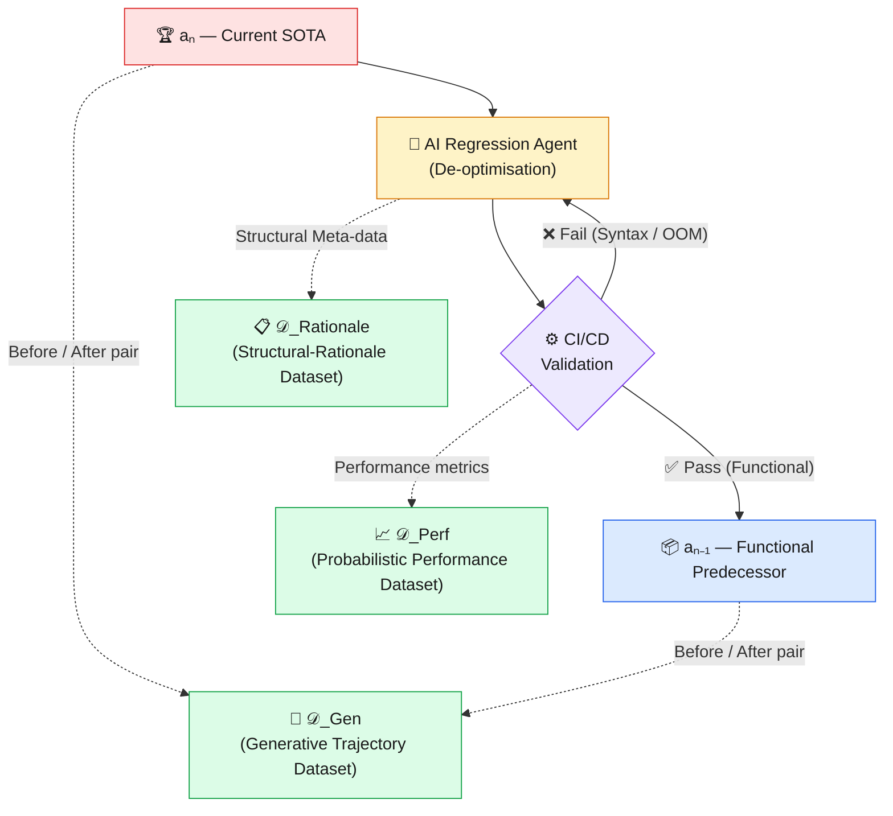
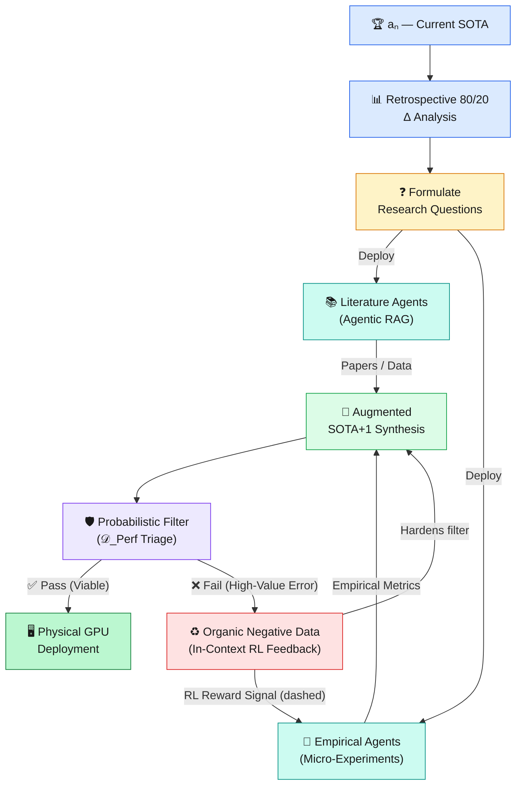

<div align="center">

# 🧬 AutoScientist-ETFT

### **Evolutionary Trajectory Fine-Tuning**
#### *Reverse-Engineering Algorithmic Progression Towards a General Innovation Accelerator*

[](https://opensource.org/licenses/MIT)
[](mailto:lukas.benda@boldpivot.cz)
[](https://github.com/luke-b/AutoScientist-ETFT)
[](https://www.python.org/)
[](https://github.com/luke-b/AutoScientist-ETFT)

> **"Teaching machines not just what we know — but the very mechanics of how we invent."**
>
> — *Lukas Benda, BoldPivot*

</div>

---

## 📖 Overview

**AutoScientist-ETFT** is a pioneering machine learning framework that transforms Large Language Models (LLMs) from *static code generators* into **autonomous research scientists**. Rather than training on disconnected code fragments, ETFT leverages precisely AI-assisted regressions of State-of-the-Art (SOTA) algorithms to teach LLMs the fundamental vectors of architectural innovation.

This repository implements the full **Open-Loop Empirical Architecture** described in the paper *"Evolutionary Trajectory Fine-Tuning: Reverse-Engineering Algorithmic Progression"* (Benda, 2026). It addresses the critical limitation of parametric memory—the *"knowledge blindspot"*—by deploying autonomous research agents that continuously retrieve up-to-date scientific literature, run empirical micro-experiments, and recycle failures as organic negative feedback.

---

## 🔑 Key Innovations at a Glance

| Innovation | What It Does |
|---|---|
| **🔁 Evolutionary Trajectory Fine-Tuning** | Trains LLMs on ordered sequences of improving algorithms—teaching the *direction* of progress, not just individual solutions |
| **🤖 Agentic Research Loop (ARL)** | Deploys literature and empirical agents to bypass the LLM's parametric knowledge cut-off in real-time |
| **📊 Retrospective 80/20 Δ Analysis** | Deterministically identifies the sub-components historically responsible for 80% of performance gains |
| **🧪 *In-Silico* Triage Filter** | Probabilistic heuristic filter that catches high-risk hypotheses (e.g., OOM errors) *before* expensive GPU evaluation |
| **♻️ Organic Negative Data Loop** | Failed experiments and triage rejections automatically harden the filter—no manual labelling required |
| **🌐 General Innovation Accelerator** | Domain-agnostic: the same machinery applies to drug discovery, materials science, supply-chain optimisation, and beyond |

---

## 🧠 Motivation: Why Existing Approaches Fall Short

The [OpenAI Parameter Golf challenge](https://openai.com/research/) is a canonical stress-test: compress a full LLM into a **16 MB artifact**, trained in **10 minutes** on an **8 × H100 cluster**. To succeed, a model must do more than recall known solutions—it must *understand how algorithms evolve* under extreme resource constraints.

Current LLMs face two fundamental blockers:

1. **Architectural Ignorance:** Training on disconnected code snippets provides no signal about *why* one design outperforms another.
2. **The Parametric Blindspot:** Pre-trained weights fossilise knowledge at the training cut-off date. Cutting-edge breakthroughs—often published days before a competition—are invisible to the model.

ETFT solves both problems simultaneously.

---

## 📐 Theoretical Foundation: The Discrete Gradient

Let **𝒜** be a set of fully functional, compilable algorithms solving a specific task. Define an objective fitness function **ℱ(a)** inversely proportional to validation loss, subject to hard hardware constraints.

An **evolutionary trajectory 𝒯** is an ordered sequence:

```
𝒯 = (a₀, a₁, …, aₙ)   where   ℱ(aᵢ₋₁) < ℱ(aᵢ)  ∀ i
```

Each transition **aᵢ₋₁ → aᵢ** represents a *macro-evolutionary jump*—a discrete, measurable improvement in architecture, efficiency, or generalisation. The entire ETFT paradigm rests on training the model to internalise these trajectories so that it can project the next jump: **aₙ → aₙ₊₁ (SOTA+1)**.

---

## 🏗️ Architecture: The Core ETFT Ecosystem

### Phase 1 — AI-Assisted Top-Down Regression Pipeline

To build the training corpus, SOTA algorithms are *reverse-engineered* into their functional predecessors. The process is fully automated and CI/CD-validated to guarantee code integrity.



> **Figure 1 — The AI-Assisted Top-Down Regression Pipeline.**
> SOTA algorithms are systematically de-optimised into functional predecessors. Rigorous CI/CD validation ensures code integrity, enabling the automated extraction of the foundational ETFT datasets.

---

### The Three Foundational Datasets

#### 🔀 `𝒟_Gen` — Generative Trajectory Dataset
Maps each lower-complexity algorithm to its more advanced successor.
```
Input:  aᵢ₋₁  (simpler algorithm)
Output: aᵢ    (advanced successor)
```
This is the *core fine-tuning signal*: the model learns to generate improvements, not just reproduce existing code.

#### 📋 `𝒟_Rationale` — Structural-Rationale Meta-Dataset
A rich, textual breakdown of each architectural shift—mapping specific code perturbations to measurable performance changes. This teaches the model *why* a change worked, not just *what* changed.

#### 📈 `𝒟_Perf` — Probabilistic Performance Estimator
Physical GPU evaluation is expensive. `𝒟_Perf` trains a **Probabilistic Heuristic Filter** that acts as an *in-silico triage*: flagging SOTA+1 candidates with a high probability of failure (Out-Of-Memory, divergent training, etc.) *before* they consume cluster time.

> 💡 **Self-Hardening by Design:** The filter never suffers from data asymmetry. Every failed SOTA+1 hypothesis—whether caught by triage or discovered during physical testing—automatically populates the negative dataset, continuously improving predictive accuracy with zero manual annotation.

---

## 🔭 Addressing the Parametric Blindspot: The Open-Loop Architecture

### Retrospective Pareto (80/20) Δ Analysis

Rather than relying on real-time code profiling, ETFT performs a **deterministic retrospective analysis** over the entire evolutionary history:

1. **Compute deltas** between every adjacent pair (aᵢ₋₁, aᵢ) in the trajectory.
2. **Quantify the character and scope** of each historical innovation.
3. **Train the LLM** to recognise which sub-components *historically* produced 80% of the performance gain.
4. **Project the learned analytical framework** forward onto the aₙ → aₙ₊₁ trajectory.

This gives the system a rich, evidence-based prioritisation strategy that tells it *where to look* for the next breakthrough—before spending a single GPU cycle.

---

### The Agentic Research Loop (ARL)

Once the 80/20 bottlenecks are identified, the model formulates targeted **Research Questions** and launches a two-phase agentic deployment:

#### Phase 1 — Deep Literature Synthesis (Agentic RAG)
Research agents autonomously scour the latest preprints and technical reports, retrieving the most recent scientific knowledge about the specific identified bottleneck. This **bypasses the LLM's parametric cut-off date entirely**—the system is always up-to-date.

#### Phase 2 — Empirical Micro-Experiments
Coding agents execute localised scripts based on the retrieved literature, gathering physical performance metrics. These are compact, targeted experiments—not full training runs—that rapidly validate or falsify specific hypotheses.

#### In-Context Reinforcement Learning
Failed micro-experiments are not discarded. They are **immediately recycled as negative reward signals**, sharpening the agent's decision-making for subsequent experimental designs in the same context window.

---

## 🚀 The Unified Synthesis: Generating SOTA+1

The final SOTA+1 algorithm emerges from the orchestrated convergence of three streams of evidence:



> **Figure 2 — The Open-Loop Empirical ETFT Ecosystem.**
> Failed triage evaluations organically populate negative datasets and route RL reward signals back to the empirical agents, creating a continuously self-improving R&D pipeline.

### The Synthesis Inputs

| Stream | Source | Role |
|---|---|---|
| **Historical Trajectories** | `𝒟_Gen` + `𝒟_Rationale` | Provides evolutionary context and architectural rationale |
| **Live Literature** | Agentic RAG (Phase 1) | Supplies cutting-edge scientific knowledge beyond the training cut-off |
| **Empirical Evidence** | Micro-experiments (Phase 2) | Grounds hypotheses in physically measured data |
| **RL Feedback** | Failed experiments & triage | Continuously refines hypothesis generation and experimental strategy |

---

## 🌍 The General Innovation Accelerator

The implications of ETFT extend **far beyond deep learning**. An algorithm is, at its core, *any set of rules that transforms inputs into outputs*. The same evolutionary trajectory methodology applies across:

```
🔬 Materials Science      →  Tracking aerospace alloy development
💊 Pharmaceuticals        →  Mapping the progression of targeted therapies
🚚 Supply Chain           →  Optimising global logistics networks
⚡ Energy Systems         →  Evolving power grid architectures
🧬 Genomics               →  Tracing gene-editing protocol refinements
🏗️ Structural Engineering →  Iterating on load-bearing design patterns
```

By combining **historical evolutionary trajectories** with **autonomous empirical inquiry**, **probabilistic triage**, and **continuous In-Context RL feedback**, ETFT provides the foundation for a domain-agnostic **General Innovation Accelerator**—a system that teaches machines not just what we know, but the very *mechanics of how we invent*.

---

## 🧩 System Components Summary

```
AutoScientist-ETFT/
├── 📂 corpus/
│   ├── regression_pipeline/    # AI-Assisted Top-Down Regression (𝒟_Gen, 𝒟_Rationale)
│   └── performance_estimator/  # Probabilistic Heuristic Filter (𝒟_Perf)
├── 📂 agents/
│   ├── literature/             # Agentic RAG — Deep Literature Synthesis
│   └── empirical/              # Coding agents — Micro-Experiments
├── 📂 analysis/
│   └── pareto_delta/           # Retrospective 80/20 Δ Analysis
├── 📂 synthesis/
│   └── sota_plus_one/          # Augmented SOTA+1 Generation & Triage
└── 📂 feedback/
    └── rl_loop/                # In-Context RL & Organic Negative Data
```

---

## ⚙️ Getting Started

### Prerequisites

- Python 3.10+
- Access to an LLM API (e.g., OpenAI, Anthropic, or a local model)
- Optional: GPU cluster for physical evaluation of SOTA+1 candidates

### Installation

```bash
git clone https://github.com/luke-b/AutoScientist-ETFT.git
cd AutoScientist-ETFT
pip install -r requirements.txt
```

### Quick Start

```bash
# Step 1: Generate the regression corpus for a target algorithm family
python corpus/regression_pipeline/run.py --target <algorithm_family>

# Step 2: Fine-tune your LLM on the generated trajectories
python train.py --dataset corpus/ --model <your-base-model>

# Step 3: Launch the Agentic Research Loop
python agents/run_arl.py --bottleneck <identified_component>

# Step 4: Generate and evaluate a SOTA+1 candidate
python synthesis/sota_plus_one/generate.py --trajectory <trajectory_id>
```

---

## 📄 Citation

If you use this work in your research, please cite:

```bibtex
@article{benda2026etft,
  title   = {Evolutionary Trajectory Fine-Tuning: Reverse-Engineering Algorithmic Progression},
  author  = {Benda, Lukas},
  journal = {Preprint},
  year    = {2026},
  month   = {April},
  note    = {Towards an Open-Loop Autonomous R\&D Ecosystem and General Innovation Accelerator}
}
```

---

## 📬 Contact

**Lukas Benda** — [lukas.benda@boldpivot.cz](mailto:lukas.benda@boldpivot.cz) — BoldPivot

---

<div align="center">

*Built on the conviction that the most powerful thing we can teach a machine*
*is not a solution — but the trajectory towards one.*

⭐ **Star this repo** if you believe in autonomous scientific discovery.

</div>
